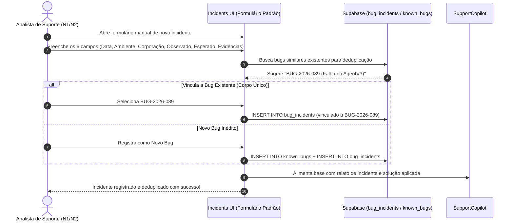
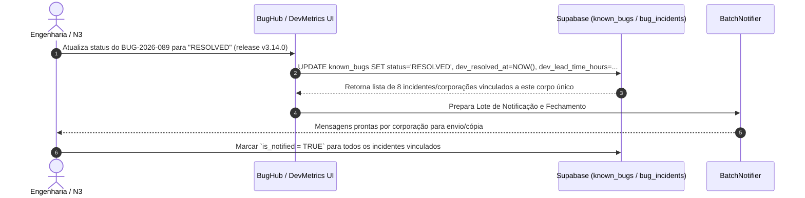

# MDM Support Hub — Especificação Técnica e Arquitetural
> **Evolução do MDM Hub Tools para Plataforma Integrada de Suporte Multi-Tenant & Gestão de Incidentes**
> **Versão:** 2.1.0-PROPOSAL | **Data:** Agosto/2026 | **Stack Base:** React 19 + TypeScript + Vite + Tailwind CSS v4 + Supabase

---

## 1. Visão Geral e Propósito

### 1.1 Contexto de Negócio
O **MDM Hub Tools** foi concebido originalmente como um conjunto de utilitários em lote (*Checker*, *ApkFinder*, *Deleter*, *Forcer*). No entanto, o papel principal da equipe de suporte da **Amazonas Inovare** não é a gestão direta de inventário de terminais (função desempenhada pela própria plataforma MDM Hub), mas sim a **resolução de problemas operacionais, triagem de falhas, tratamento de chamados e mapeamento de impacto entre corporações (tenants)**.

### 1.2 A Nova Proposta: MDM Support Hub
Esta especificação transforma a aplicação em uma **Plataforma de Suporte Técnico Multi-Tenant**, permitindo:
- Catalogar **Bugs Conhecidos** e falhas sistêmicas da plataforma MDM.
- **Cadastrar Incidentes Manuais de Forma Padronizada** com campos estruturados obrigatórios.
- Mapear a relação entre **Bugs Conhecidos (Corpo Único) ↔ Corporações Afetadas ↔ Chamados de Suporte (Incidentes)**.
- **Deduplicar erros**, vinculando incidentes idênticos de clientes diferentes em uma só falha raiz (evitando chamados soltos e duplicados).
- Alimentar uma **Base de Conhecimento RAG acoplada a IA** que sugere respostas e contornos automáticos baseados nas resoluções cadastradas.
- Diagnosticar automaticamente se uma lista de dispositivos reportados por um cliente sofre de uma falha já catalogada.
- Notificar clientes e encerrar chamados em lote assim que uma correção de engenharia for lançada.
- Fornecer **relatórios de SLA da Engenharia** (tempo de demora do Dev para solução) e estabilidade por corporação para a gestão.

### 1.3 Modelo de Autenticação & Autorização (Acesso Padrão Unificado)
- **Autenticação Centralizada:** O acesso ao `mdm_tools` continua integrado ao endpoint de login da API do MDM Hub (`POST /api-acl/authentication/login`).
- **Nível de Acesso Unificado ("Root de Suporte"):** Todos os analistas de suporte autenticados possuem acesso total padronizado às funcionalidades de cadastro de bugs, triagem de chamados, atualização de status e relatórios, sem restrições por níveis ou papéis (RBAC).
- **Rastreabilidade Automática por Usuário:** A partir do token JWT do usuário autenticado no MDM-Hub (ex: `henrique.paiva`, `analista.silva`), o sistema registra automaticamente em todas as tabelas do Supabase os campos `created_by` e `updated_by`, garantindo total transparência e auditabilidade sobre quem executou cada ação na ferramenta.

### 1.4 Pilares Operacionais e Arquitetura de Dados (Modelo Miro)
Com base no mapeamento operacional estabelecido para a plataforma:
1. **Abertura Manual de Chamados Padronizada:** Abertura feita manualmente pelos analistas de suporte através de formulário obrigatório com 6 campos padronizados (*Data, Ambiente, Corporação/Usuário, Comportamento Observado, Comportamento Esperado e Evidências*).
2. **Deduplicação (Corpo Único de Bug):** O sistema não permite chamados dispersos de erros iguais. Múltiplos incidentes de diferentes corporações são vinculados a um **único corpo central de bug** (`known_bugs`).
3. **Alimento para IA (Soluções RAG):** As resoluções e workarounds registrados nos chamados alimentam continuamente a engine de IA, permitindo que ela atue como assistente virtual de respostas para o N1.
4. **Métricas da Engenharia & Gestão:** Painéis executivos fornecem o histórico de bugs por corporação, os problemas que mais impactam o dia a dia da operação e a medição do tempo de resposta (SLA / Demora) da equipe de desenvolvimento.

---

## 2. Matriz de Módulos e Capacidades

| Módulo | Propósito Principal | Principais Recursos |
| :--- | :--- | :--- |
| **BugHub** *(Central de Bugs)* | Catalogação de falhas e soluções temporárias. | Cadastro de bugs conhecidos (Corpo Único), severidade, sintomas, contorno (workaround) e status de correção (Dev/Release). |
| **IncidentsManager** *(Gestão de Incidentes)* | Abertura manual padronizada e deduplicação de chamados. | Formulário rigoroso com 6 campos obrigatórios (Data, Ambiente, Corporação, Observado, Esperado, Evidências) e vinculação a bugs. |
| **SupportCopilot** *(Base de Soluções & IA)* | Assistente de IA para respostas rápidas. | Leitura de fontes de dados e histórico de resoluções para apresentar soluções sugeridas ao analista de suporte em tempo real. |
| **DevMetrics & SLA** *(Métricas da Engenharia)* | Medição de tempo de resolução do desenvolvimento. | Painel de auditoria de SLA Dev, tempo médio de demora para solução (Lead Time) e mapa de gargalos por componente. |
| **CorporationHealth** *(Saúde por Cliente)* | Visão 360° do impacto por corporação. | Mapeamento de corporações afetadas, histórico de incidentes por tenant e índice de estabilidade operacional. |
| **Troubleshooter** *(Triador de Chamados)* | Diagnóstico inteligente de falhas em lote. | Leitura de seriais/logs de uma corporação, cruzamento com `api-eqp` e matching automático com Bugs Conhecidos. |
| **BatchNotifier** *(Encerramento em Lote)* | Comunicação e fechamento de chamados. | Geração de respostas padrão e notificação por e-mail/ticket de todos os chamados afetados por um bug resolvido. |
| **Tools Tradicionais** *(Checker, ApkFinder, Deleter, Forcer)* | Execução de ações corretivas diretas. | Mantidos e integrados para aplicação imediata de workarounds sobre a frota afetada. |

---

## 3. Modelo de Dados (Supabase DDL)

Para dar suporte aos novos módulos mantendo a rastreabilidade e auditabilidade, estendemos o schema existente do **Supabase**.

```sql
-- ============================================================================
-- SCHEMAS ADICIONAIS PARA O MDM SUPPORT HUB v2.1
-- Execute no SQL Editor do projeto Supabase
-- ============================================================================

-- 1. Enum para Status de Correção do Bug
CREATE TYPE bug_status AS ENUM (
    'INVESTIGATING',   -- Em análise pelo time de N3/Dev
    'WORKAROUND_READY',-- Workaround disponível para o Suporte
    'IN_DEVELOPMENT',  -- Em correção no backlog de engenharia
    'AWAITING_RELEASE',-- Corrigido em staging, aguardando deploy
    'RESOLVED',        -- Deploy realizado em produção
    'CLOSED'           -- Encerrado e validado
);

-- 2. Enum para Severidade
CREATE TYPE bug_severity AS ENUM (
    'CRITICAL', -- Paralisa operação inteira de uma corporação
    'HIGH',     -- Afeta funcionalidade core (ex: sync/instalação)
    'MEDIUM',   -- Problema de UX ou falha pontual em modelo específico
    'LOW'       -- Cosmético ou inconsistência secundária
);

-- 3. Enum para Ambiente do Incidente
CREATE TYPE incident_environment AS ENUM (
    'PRODUCTION',
    'STAGING',
    'DEVELOPMENT'
);

-- 4. Tabela Principal de Bugs Conhecidos (Known Issues - Corpo Único)
CREATE TABLE IF NOT EXISTS known_bugs (
    id UUID DEFAULT gen_random_uuid() PRIMARY KEY,
    bug_code VARCHAR(20) UNIQUE NOT NULL, -- Ex: BUG-2026-089
    title TEXT NOT NULL,
    description TEXT NOT NULL,
    symptoms JSONB DEFAULT '[]'::jsonb, -- Array de strings com padrões de log ou sintomas
    workaround_instructions TEXT, -- Passo a passo para o N1 atender o cliente
    affected_components JSONB DEFAULT '[]'::jsonb, -- Ex: ["ApkInstaller", "ForceData", "AgentV3"]
    severity bug_severity DEFAULT 'MEDIUM',
    status bug_status DEFAULT 'INVESTIGATING',
    target_release_version VARCHAR(50), -- Ex: "v3.14.0"
    dev_assigned_at TIMESTAMP WITH TIME ZONE, -- Data de envio para a Engenharia
    dev_resolved_at TIMESTAMP WITH TIME ZONE, -- Data de conclusão pelo Dev
    dev_lead_time_hours NUMERIC(10, 2), -- Tempo decorrido de solução em horas
    created_by TEXT NOT NULL,
    updated_by TEXT NOT NULL,
    created_at TIMESTAMP WITH TIME ZONE DEFAULT timezone('utc'::text, now()) NOT NULL,
    updated_at TIMESTAMP WITH TIME ZONE DEFAULT timezone('utc'::text, now()) NOT NULL
);

-- 5. Tabela de Incidentes Padronizados (Abertura Manual de Chamados - 6 Campos Obrigatórios)
CREATE TABLE IF NOT EXISTS bug_incidents (
    id UUID DEFAULT gen_random_uuid() PRIMARY KEY,
    bug_id UUID REFERENCES known_bugs(id) ON DELETE CASCADE, -- Vinculação ao Corpo Único do Bug
    ticket_number TEXT NOT NULL, -- Código do chamado interno/GLPI (ex: "INC-9482")
    environment incident_environment DEFAULT 'PRODUCTION' NOT NULL, -- Ambiente
    corporation_id TEXT NOT NULL, -- Código da Corporação/Tenant
    corporation_name TEXT NOT NULL, -- Nome do Cliente/Corporação
    reporter_contact TEXT NOT NULL, -- Usuário de report/solicitante
    reported_at TIMESTAMP WITH TIME ZONE DEFAULT timezone('utc'::text, now()) NOT NULL, -- Data do report
    observed_behavior TEXT NOT NULL, -- Comportamento observado (erro ocorrido)
    expected_behavior TEXT NOT NULL, -- Comportamento esperado
    evidence_urls JSONB DEFAULT '[]'::jsonb, -- Links/URLs de prints, logs ou evidências
    affected_devices_count INTEGER DEFAULT 1,
    affected_serials JSONB DEFAULT '[]'::jsonb, -- Lista de seriais vinculados ao chamado
    resolution_notes TEXT, -- Resolução aplicada neste incidente especificamente
    is_notified BOOLEAN DEFAULT FALSE, -- Se a corporação já foi avisada da correção
    created_by TEXT NOT NULL,
    updated_by TEXT NOT NULL,
    created_at TIMESTAMP WITH TIME ZONE DEFAULT timezone('utc'::text, now()) NOT NULL,
    updated_at TIMESTAMP WITH TIME ZONE DEFAULT timezone('utc'::text, now()) NOT NULL
);

-- 6. Tabela da Base de Conhecimento e Soluções (Alimento para a IA)
CREATE TABLE IF NOT EXISTS ai_knowledge_solutions (
    id UUID DEFAULT gen_random_uuid() PRIMARY KEY,
    bug_id UUID REFERENCES known_bugs(id) ON DELETE CASCADE,
    incident_id UUID REFERENCES bug_incidents(id) ON DELETE SET NULL,
    problem_summary TEXT NOT NULL,
    solution_steps TEXT NOT NULL,
    tags JSONB DEFAULT '[]'::jsonb, -- Palavras-chave para buscas
    times_used INTEGER DEFAULT 0, -- Quantas vezes essa solução ajudou em chamados
    created_by TEXT NOT NULL,
    created_at TIMESTAMP WITH TIME ZONE DEFAULT timezone('utc'::text, now()) NOT NULL
);

-- 7. Índices para Alto Desempenho em Consultas
CREATE INDEX IF NOT EXISTS idx_known_bugs_status ON known_bugs(status);
CREATE INDEX IF NOT EXISTS idx_known_bugs_code ON known_bugs(bug_code);
CREATE INDEX IF NOT EXISTS idx_incidents_bug_id ON bug_incidents(bug_id);
CREATE INDEX IF NOT EXISTS idx_incidents_corp ON bug_incidents(corporation_id);
CREATE INDEX IF NOT EXISTS idx_incidents_env ON bug_incidents(environment);
CREATE INDEX IF NOT EXISTS idx_ai_solutions_bug ON ai_knowledge_solutions(bug_id);

-- 8. Habilitar RLS (Row Level Security)
ALTER TABLE known_bugs ENABLE ROW LEVEL SECURITY;
ALTER TABLE bug_incidents ENABLE ROW LEVEL SECURITY;
ALTER TABLE ai_knowledge_solutions ENABLE ROW LEVEL SECURITY;

-- 9. Políticas RLS (Acesso seguro para usuários autenticados na aplicação)
CREATE POLICY "Allow select on known_bugs" ON known_bugs FOR SELECT USING (true);
CREATE POLICY "Allow insert/update on known_bugs" ON known_bugs FOR ALL USING (true);

CREATE POLICY "Allow select on bug_incidents" ON bug_incidents FOR SELECT USING (true);
CREATE POLICY "Allow insert/update on bug_incidents" ON bug_incidents FOR ALL USING (true);

CREATE POLICY "Allow select on ai_knowledge_solutions" ON ai_knowledge_solutions FOR SELECT USING (true);
CREATE POLICY "Allow insert/update on ai_knowledge_solutions" ON ai_knowledge_solutions FOR ALL USING (true);
```

---

## 4. Arquitetura de Componentes Front-End

A estrutura de arquivos segue **rigorosamente** os padrões arquiteturais de `mdm_tools`:
- Separação entre componentes visualizadores (`TSX`) e hooks de negócio (`use*.ts`).
- Comunicação de dados do Supabase isolada na camada de cliente (`src/supabase.ts`).
- Utilitários de API do MDM Hub concentrados em `src/api.ts`.

```
src/
├── tools/
│   ├── BugHub/                          — Módulo: Central de Bugs Conhecidos (Corpo Único)
│   │   ├── index.tsx                    — Componente orquestrador da aba
│   │   ├── ConfigPanel.tsx              — Form/Filtro para criar e buscar bugs
│   │   ├── BugCardList.tsx              — Lista visual de cartões de bugs ativos
│   │   ├── BugDetailModal.tsx           — Modal de prontuário do bug & incidentes vinculados
│   │   ├── LogPanel.tsx                 — Histórico de alterações e comentários
│   │   └── useBugHub.ts                 — Hook com estado, CRUD e integração Supabase
│   │
│   ├── Incidents/                       — Módulo: Abertura & Gestão Manual de Incidentes
│   │   ├── index.tsx                    — Orquestrador de incidentes
│   │   ├── NewIncidentForm.tsx          — Formulário com os 6 campos obrigatórios padronizados
│   │   ├── IncidentListTable.tsx        — Tabela de chamados com filtro e wrappers responsivos
│   │   ├── BugLinkerModal.tsx           — Modal de busca e vínculo ao Corpo Único do Bug
│   │   └── useIncidents.ts              — Hook de cadastro manual e vinculação
│   │
│   ├── SupportCopilot/                  — Módulo: Assistente de IA & Base de Soluções
│   │   ├── index.tsx                    — Chat e busca rápida de soluções por IA
│   │   ├── SolutionCard.tsx             — Exibição de soluções recomendadas com cópia rápida
│   │   └── useSupportCopilot.ts         — Hook de integração RAG / consulta de soluções
│   │
│   ├── DevMetrics/                      — Módulo: Análise de SLA da Engenharia
│   │   ├── index.tsx                    — Painel de métricas Dev e relatórios de tempo
│   │   ├── SLAChart.tsx                 — Gráficos de demora de solução por componente/gravidade
│   │   └── useDevMetrics.ts             — Hook de cálculo de Lead Time Dev
│   │
│   ├── CorporationHealth/               — Módulo: Saúde por Cliente/Tenant
│   │   ├── index.tsx                    — Orquestrador do Dashboard de Clientes
│   │   ├── TenantOverviewGrid.tsx       — Grid de cards com score de estabilidade por cliente
│   │   └── useCorporationHealth.ts      — Hook com métricas e agregações
│   │
│   ├── Troubleshooter/                  — Módulo: Triador Automático de Problemas
│   │   ├── index.tsx                    — Orquestrador da ferramenta de diagnóstico
│   │   ├── DiagnosticConfigPanel.tsx    — Input de seriais ou colar logs de erro da corporação
│   │   ├── MatchResultPanel.tsx         — Exibição dos bugs correspondentes (Match Scoring)
│   │   └── useTroubleshooter.ts         — Hook com algoritmo de matching sintomático
│   │
│   ├── BatchNotifier/                   — Módulo: Comunicação em Lote
│   │   ├── index.tsx                    — Orquestrador de notificações
│   │   └── useBatchNotifier.ts          — Hook para despacho de atualizações aos chamados
│   │
│   ├── Checker/                         — Mantido
│   ├── ApkFinder/                       — Mantido
│   ├── Deleter/                         — Mantido
│   └── Forcer/                          — Mantido
```

---

## 5. Diretrizes de Design UI/UX e Regras de Projeto (`AGENTS.md`)

Para evitar quebras de layout e manter a experiência responsiva e acessível em desktop e mobile:

### 5.1 Navegação Mobile (Floating Bottom Bar via React Portal)
- O menu de navegação entre os módulos no mobile (resoluções `< 768px`) **deve ser renderizado via `createPortal`** direto em `document.body`.
- A barra flutuante deve manter `bottom: 12px`, `left: 12px`, `right: 12px`, `z-index: 9999` e cantos arredondados (`rounded-2xl`).
- Ícones centralizados no mobile sem texto, com rótulos `aria-label` WCAG 2.2 para acessibilidade.

### 5.2 Prevenção de Scroll Horizontal ("Quebra de Tela")
- Manter `html, body { max-width: 100vw; overflow-x: hidden; }` no `index.css`.
- Toda tabela de incidentes, bugs ou corporações **deve ser envelopada** no container responsivo:
```tsx
<div className="w-full max-w-full overflow-x-auto rounded-xl border border-border/40 bg-card shadow-sm">
  <Table>...</Table>
</div>
```

### 5.3 Posicionamento de Elementos Flutuantes
- O botão global de feedback/suporte deve usar a classe responsiva:
  - Desktop: `bottom-6 right-6`
  - Mobile (`< 768px`): `max-md:bottom-[88px] max-md:right-4`

### 5.4 Identidade Visual e Header Resiliente
- Título principal (`MDM Hub - Support Tools`) compacto em linha única com `whitespace-nowrap` e tipografia `text-lg sm:text-2xl`.
- Sistema de temas (Claro/Escuro) utilizando variáveis CSS customizadas baseadas em HSL.
- Badges de severidade com cores semânticas Tailwind:
  - **CRITICAL:** `bg-rose-500/15 text-rose-500 border-rose-500/30`
  - **HIGH:** `bg-amber-500/15 text-amber-500 border-amber-500/30`
  - **MEDIUM:** `bg-sky-500/15 text-sky-500 border-sky-500/30`
  - **RESOLVED:** `bg-emerald-500/15 text-emerald-500 border-emerald-500/30`

---

## 6. Fluxos de Trabalho Operacionais (User Journeys)

### Fluxo A: Abertura Manual de Incidente e Deduplicação em Corpo Único


### Fluxo B: Resolução de Bug pela Engenharia & Medição de SLA Dev


---

## 7. Plano de Implementação (Roadmap de Engenharia)

### Fase 1: Fundação de Dados & Abertura Manual de Incidentes
- [ ] Executar o script DDL v2.1 no Supabase (tabelas `known_bugs`, `bug_incidents`, `ai_knowledge_solutions`).
- [ ] Criar tipos TypeScript em `src/types/bugs.ts` e `src/types/incidents.ts`.
- [ ] Implementar o módulo `Incidents` com formulário padronizado de 6 campos obrigatórios e tabela com wrapper responsivo.
- [ ] Implementar a vinculação de incidentes ao **Corpo Único de Bug** em `BugHub`.

### Fase 2: Saúde por Cliente & Auditoria de Corporações (`CorporationHealth`)
- [ ] Implementar a aba `CorporationHealth`.
- [ ] Criar gráficos e cards de volumetria de incidentes por corporação.
- [ ] Permitir a consulta do histórico completo de falhas por cliente.

### Fase 3: Assistente de IA & Base de Soluções (`SupportCopilot`)
- [ ] Implementar o módulo `SupportCopilot` para busca e sugestão de soluções a partir da base alimentada pelos chamados.
- [ ] Desenvolver engine de recomendação rápida de contorno (workaround) baseada nos sintomas cadastrados.

### Fase 4: Métricas de SLA da Engenharia & Relatórios Executivos (`DevMetrics`)
- [ ] Implementar o módulo `DevMetrics` para calcular o tempo de demora (Lead Time) da Engenharia entre abertura do bug e release.
- [ ] Criar gerador de relatórios em Excel/PDF para diretoria e líderes de produto.

---

## 8. Conclusão

Com a especificação atualizada v2.1, o **MDM Support Hub** consolida o fluxo de suporte operacional: os analistas realizam a **abertura manual padronizada** de chamados, o sistema garante a **deduplicação centralizada em corpos únicos de bugs**, a **IA aprende continuamente com as soluções** para auxiliar o atendimento de N1, e a gestão ganha **total visibilidade sobre o SLA do time de engenharia** e a saúde de cada corporação.
